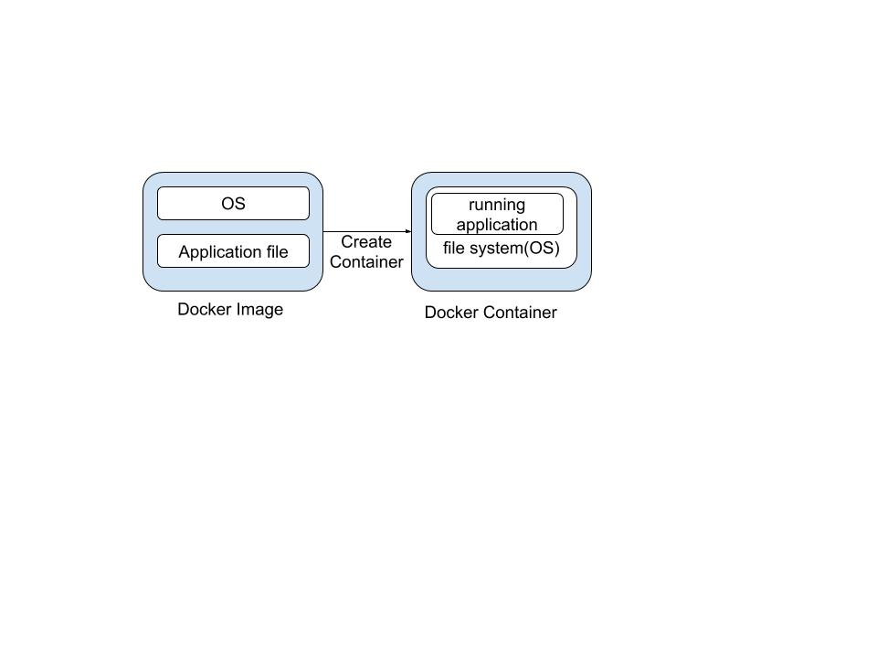

## 도커

#### 도커란?
 - 도커(Docker)는 리눅스의 응용 프로그램들을 소프트웨어 컨테이너 안에 배치시키는 일을 자동화하는 오픈 소스 프로젝트이다. 도커 웹 페이지의 기능을 인용하면 다음과 같다
 - 도커 컨테이너는 일종의 소프트웨어를 소프트웨어의 실행에 필요한 모든 것을 포함하는 완전한 파일 시스템 안에 감싼다. 여기에는 코드, 런타임, 시스템 도구, 시스템 라이브러리 등 서버에 설치되는 무엇이든 아우른다. 이는 실행 중인 환경에 관계 없이 언제나 동일하게 실행될 것을 보증한다.
 - 환경의 영향을 덜받고 배포가 간편함.

#### 도커가 적합한 경우
 - 테스트환경이 필요할 경우
 - 동일한 운영환경이 여러개 필요할 경우

#### 도커가 적합하지 않은 경우
 - linux의 Deep한 기능까지 사용해야하는 경우. 즉 정확한 리눅스 계열 운영체제의 동작이 요구되는 환경일경우
 - 비리눅스 환경이 필요한 경우

#### 장점
 - 환경차이로 인한 문제 방지 : 인프라환경까지 묶어서 이미지째로 배포해버리니 각 서버별 환경으로 인한 문제점을 줄일 수 있다.
 - 여러 벤더사들이 도커허브에 자신들의 이미지를 최신화하여 올리고 있으며 사용자는 좀더 쉽게 검증된 이미지들을 받아서 적용할 수 있다. -> https://hub.docker.com/
 - 기존의 컨테이너를 빠르게 폐기하고 새로 구축할 수 있다.

#### 단점
 - 이미지째로 빌드, 배포되기 때문에 그 이미지 자체에 문제가 있다면 파급효과가 크다. 특히 보안취약점은 주의해야 한다.
 - 개발과 운영 모두에게 혜택을 줄수 있겠지만, 데브옵스를 할 수 없는 운영자에게 도커를 쓰게 한다면 그 회사의 IT환경은 도커의 장점을 전혀 누릴 수 없다.

#### 기본개념

 - 도커는 컨테이너형 가상화를 구현하기 위한 상주 어플리케이션과 이를 관리하는 명령형도구로 구성된다.
 - LXC(Linux Containers)를 사용하여 동작하였지만 현재엔 LXC없이도 동작이 가능.
 - 도커 이미지 하나로 여러개의 컨테이너를 생성할 수 있다.

### 도커전용 도메인 언어 기본 명령
#### FROM
 - 도커 이미지의 바탕이 될 베이스 이미지를 지정한다.
 - 도커허브에서 이미지를 받아오며, 예를 들면 go 언어로 작성된 Application을 도커형태로 배포하고싶다면 go 언어의 런타임이 설치된 golang 이미지가 필요하다.

#### RUN
 - 도커 컨테이너 안에서 실행할 명령을 기술한다.
 - 이미지를 빌드할때 실행됨.
 - 애플리케이션 업데이트 및 배치

#### COPY
 - 도커가 동작중인 호스트 머신의 파일이나 디렉토리를 도커 컨테이너 안으로 복사한다.

#### CMD
 - 도커 컨테이너를 실행할 때 컨테이너 안에서 실행할 프로세스를 지정한다.
 - CMD는 컨테이너를 시작할때 한번 시작한다.
 - 애플리케이션 자체를 실행하는 명령어

### 기본 사용법
~~~
docker image pull
docker image build
docker image push
docker container run
docker container ls
docker container rm
~~~

### 기타~
 - LXC (LinuX Containers) : 단일 컨트롤 호스트 상에서 여러 개의 고립된 리눅스 시스템 (컨테이너)들을 실행하기 위한 운영 시스템 레벨 가상화 방법이다. cgroups(CPU, 메모리, 블록 I/O, 네트워크 등 고립)와 namespace(애플리케이션 입장에서 프로세스 트리, 네트워크, 사용자 ID, 마운트된 파일 시스템 등의 운영 환경을 완전히 고립)를 결합하여 애플리케이션을 위한 고립된 환경을 제공한다.
 - Docker Compose, Docker Swarm 등 도커 관리도구들이 있지만 사실상 표준으로 자리잡은것은 쿠버네티스이다. 쿠버네티스는 구글이 오랫동안 컨테이너를 운영하면서 얻은 노하우를 담은 오픈소스.
