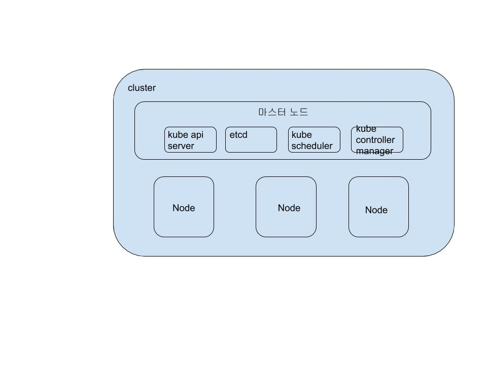
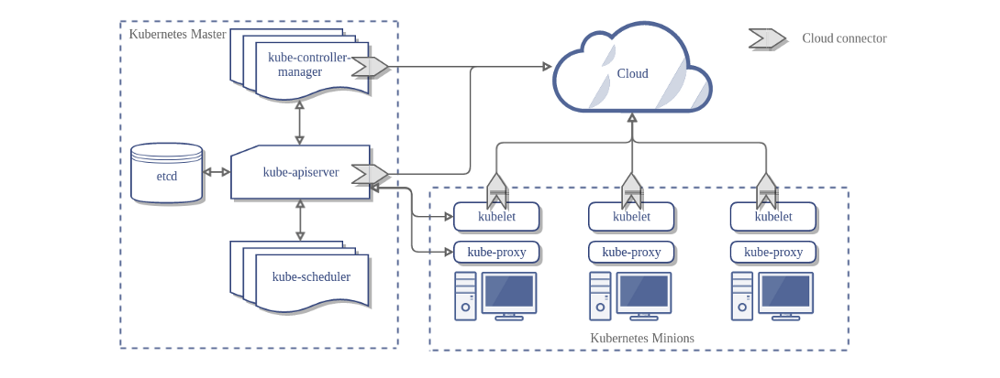
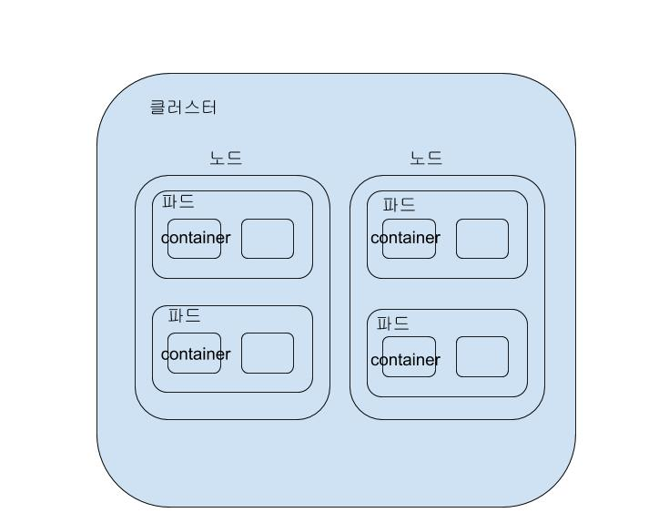
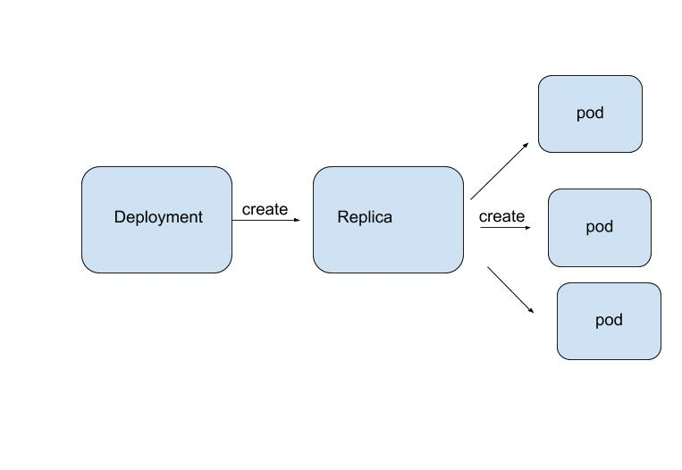

## 쿠버네티스 입문

#### 쿠버네티스
-   컨테이너 운영을 자동화하기 위한 컨테이너 오케스트레이션 도구
-   컨테이너를 이용한 애플리케이션 배포 , 운영 , 도커 호스트 관리 , 서버 리소스를 고려한 컨테이너 배치,스케일링,로드밸런싱 , 헬스체크등
-   쿠버네티스로 실행하는 애플리케이션은 애플리케이션을 구성하는 다양한 리소스가 함계 연동해 동작

##### kubectl
-   쿠버네티스를 운영하기 위한 cli 툴

##### 리소스(책에서는 리소스라고 부르는데 Document에서는 Object라고 한다.)
| 리소스               | 용도                                                         |
| -------------------- | ------------------------------------------------------------ |
| 노드                 | 컨테이너가 배치되는 서버                                     |
| 네임스페이스         | 쿠버네티스 클러스터 안의 가상 클러스터                       |
| 파드                 | 컨테이너의 집합 중 가장 작은 단위로 , 컨테이너의 실행 방법을 정의한다. |
| 레플리카세트         | 같은 스펙을 갖는 파드를 여러 개 생성하고 관리하는 역할을 한다 |
| 디플로이먼트         | 레플리카 세트의 리비전을 관리한다.                           |
| 서비스               | 파드의 집합에 접근하기 위한 경로를 정의한다.                 |
| 인그레스             | 서비스를 쿠버네티스 클러스터 외부로 노출시킨다               |
| 컨피그맵             | 설정 정보를 정의하고 파드에 전달한다.                        |
| 퍼시스턴트볼륨       | 파드가 사용할 스토리지의 크기 및 종류를 정의                 |
| 퍼시스턴트볼륨클레임 | 퍼시스턴트 볼륨을 동적으로 확보                              |
| 스토리지클래스       | 퍼시스턴트 볼륨이 확보하는 스토리지의 종류를 정의            |
| 스테이트풀세트       | 같은 스펙으로 모두 동일한 파드를 여러 개 생성하고 관리       |
| 잡                   | 상주 실행을 목적으로 하지 않는 파드를 여러 개 생성하고 정상적인 종료를 보장 |
| 크론잡               | 크론 문법으로 스케줄링되는 잡                                |
| 시크릿               | 인증 정보같은 기밀 데이터를 정의한다.                        |
| 롤                   | 네임스페이스 안에서 조작 가능한 쿠버네티스 리소스의 규칙을 정의 |
| 롤 바인딩            | 쿠버네티스 리소스 사용자와 롤을 연결                         |
| 클러스터롤           | 클러스터 전체적으로 조작 가능한 쿠버네티스 리소스의 규칙을 정의 |
| 클러스터롤바인딩     | 쿠버네티스 리소스 사용자와 클러스터롤을 연결 짓는다.         |
| 서비스 계정          | 파드가 쿠버네티스 리소스를 조작할 때 사용하는 계정           |

#### 쿠버네티스 클러스터
-   쿠버네티스의 여러 리소스를 관리하기 위한 집합체
-   클러스터 전체를 관리하는 서버인 마스터 노드가 하나이상 존재해야한다.
-   노드의 리소스 사용 현황 및 배치 전략을 근거로 컨테이너를 배치
    -   노드의수 , 노드의 사양등에 따라 배치할 수 있는 컨테이너 수가 결정 된다.
#### 노드
-   쿠버네티스 클러스터의 관리 대상으로 등록된 도커 호스트로 컨테이너가 배치되는 대상

#### 기본적인 구조

##### 마스터 노드 구성
###### kube api server
-   쿠버네티스는 모든 명령과 통신을 API를 통해서
-   쿠버네티스 API를 노출하는 컴포넌트 kubectl로부터 리소스를 조작하라는 지시를 받는 역할
###### etcd
-   고가용성을 갖춘 분산 키-값 스토어
-   클러스터의 데이터베이스 역할이 되는 서버로 설정값이나 클러스터의 상태를 저장하는 서버
###### 스케줄러
-   노드를 모니터링하고 컨테이너를 배치할 적절한 노드를 선택하는 역할
###### 컨트롤러 매니저
-   리소스를 제어하는 컨트롤러
-   컨트롤러를 구동하는 역할
-   컨트롤러는 개별 프로세스이지만 복잡성을 낮추기 위해 단일 바이너리로 컴파일 되고 단일 프로세스 내에서 실행된다.
    -   노드 컨트롤러 : 노드가 다운되었을 때 대으에 대한 책임
    -   레플리케이션 컨트롤러 : 시스템의 모든 레플리케이션 컨트롤러 오브젝트에 알맞는 수의 파드들을 유지 시켜주는 역할
    -   엔드포인트 컨트롤러 : 서비스와 프드를 연결시키는 역할
    -   서비스 어카운트 & 토큰 컨트롤러 : 새로운 네임스페이스에 대한 기본 계정과 API 접근 토큰을 생성

### 구체적인 구조도

#### kubelet
-    노드에 배포되는 에이전트로 마스터와 통신을 하면서 노드가 수행해야 할 명령을 받아서 수행하고 , 노드의 상태를 마스터로 전달
#### Kube-proxy
-   노드로 들어오는 요청을 적절한 컨테이너로 라우팅     

#
### NameSpace
-   클러스터 안의 가상 클러스터
-   클러스터를 처음 구축하게 되면 default , kube-public , kube-system 3개가 이미 생성
-   kubectl get namespace 명령어
    -   클러스터 안에 존재하는 네임스페이스 목록
-   네임스페이스는 개발팀이 일정 규모 이상일 때 유용하다
-   클러스터내에 개발/운영/테스트가있을 때 namespace를 개발/운영/테스트로 나누어 관리 할 수 있다.
-   사용자별로 네임스페이스별 접근 권한을 다르게 운영가능
-   네임스페이스별로 리소스의 할당량을 지정하며 리소스를 나눠서 관리 할 수 있다.
-   주의점 물리적 나누는것이 아니라 논리적으로 나누는 것이다.

#
### pod
-   컨테이너가 모인 집합체의 단위 , 하나 이상의 컨테이너로 이루어진다.
-   쿠버네티스 애플리케이션의 기본 실행 단위
-   노드 안에 여러 pod가 존재한다.
-   pod안에 여러 컨테이너(docker)가 존재한다.(하나만 존재 할 수 있다.)

-  pod는 하나의 노드에만 속해 있어야한다.
    -   여러 노드에 걸쳐 있을 수 없다.
-   각각의 파드는 유일한 IP주소를 할당 받는다.
-   공유 저장소 집한인 Volumes를 명시 할 수 있다. 같은 파드안에 있는 컨테이너들은 공유 볼륨에 접근이 가능
    -   이말은 컨테이너끼리 데이터를 공유하는 것을 허용한다.
- kubectl로도 만들수 있으나 버전관리를 위해 yaml 파일로 작성해라
```aidl
apiVersion: v1
kind: Pod ## obejct 유형 해당 속성에 따라 spec의 구성요소가 변화 한다.
metadata: ## object에 부여되는 이름
  name: myapp-pod 
  labels:
    app: myapp
spec: ## Objet 속성을 명시한다.
  containers:
  - name: myapp-container
    image: busybox ## 도커 허브에 저장된 이미지 태그값을 지정
    command: ['sh', '-c', 'echo 안녕하세요 쿠버네티스! && sleep 3600']
  - name: myapp-container1
      image: busybox1 ## 도커 허브에 저장된 이미지 태그값을 지정
      command: ['sh', '-c', 'echo 안녕하세요 쿠버네티스2! && sleep 3600']
   
 
 ## 느낌은 compose랑 유사하다고 생각한다. 
```
-   파일을 생성했으면 
```
kubectl apply -f <yaml파일 경로>
```
-   활성화 상태는
```
kubectl get pod
```
- pod 삭제는
```
kubectl delete -f <yam파일>
```
-   주의점
    -   파드안에 컨테이너가 포트를 개방하고 있다면 다른 컨테이너와 충동하지 않도록 해야한다.
   
#    
### 레플리카 세트
-   위에서 설명한 yaml파일로는 파드를 하나밖에 생성할 수 없다.
-   동일한 yaml파일로 여러개의 복제 파드를 생서하고 싶다면 yaml 파일로 작성한다.
```aidl
apiVersion: apps/v1
kind: ReplicaSet
metadata:
  name: frontend
  labels:
    app: guestbook
    tier: frontend
spec:
  # modify replicas according to your case
  replicas: 3
  selector:
    matchLabels:
      tier: frontend
  template:
    metadata:
      labels:
        tier: frontend
    spec:
      containers:
      - name: php-redis
        image: gcr.io/google_samples/gb-frontend:v3
```
-   파일을 생성했으면 
```
kubectl apply -f <yaml파일 경로>
```

- 레플리카 삭제는
```
kubectl delete -f <yam파일>
```

-   레플리카 yaml 파일에서 레플리카의 수를 줄이면 파드가 줄인 수만큼 삭제된다.

#
### Deployment
-   레플라키세트를 관리하기 위한 리소스

```
## deployment template

apiVersion: apps/v1
kind: Deployment
metadata:
  name: nginx-deployment
  labels:
    app: nginx
spec:
  replicas: 3
  selector:
    matchLabels:
      app: nginx
  template:
    metadata:
      labels:
        app: nginx
    spec:
      containers:
      - name: nginx
        image: nginx:1.7.9
        ports:
        - containerPort: 80
```
-   파일을 생성했으면 
```
kubectl apply -f <yaml파일 경로>
```
-   실제 운영에서는 replicaSet 보다는 deployment더 많이 사용한다.
-   디플로이먼트를 수정하면 레플리카 세트가 새로 생성되고 기존 레플리카와 교체 된다.
    -   리비전이 올라간다(elasticsearch version올라가는거와 유사)
    -   레플리카 값만 변경했을때는 레플리카 세트가 일어나지 않는다.
    -   컨테이너의 직접적인 변경이 있을때 교체
-   리비전을 기록하는 이유는 이전 리비전으로 롤백할 수 있다.
-   디플로이먼트를 삭제할 수 있는데 연관된 replicaSet , pod또한 같이 삭제된다.