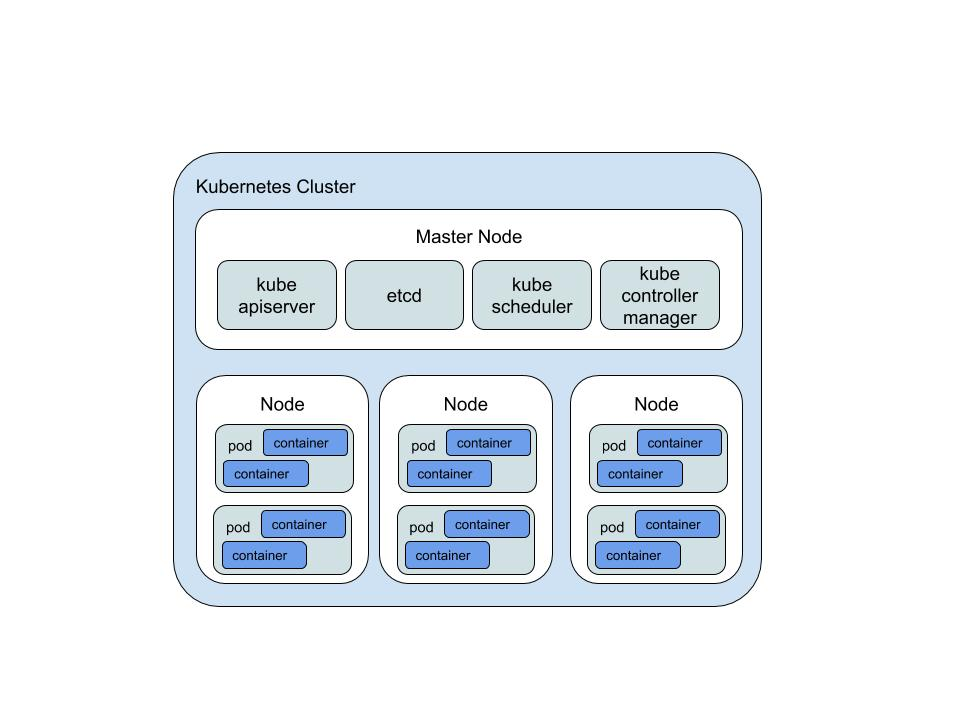

### K8s 입문
 - 2017년 쿠버네티스가 정식으로 도커에 통합되었다. 사실상 오케스트레이션 도구의 표준이 됨.

#### 쿠버네티스란
 - 쿠버네티스(Kubernetes, 쿠베르네테스, "K8s")는 디플로이 자동화, 스케일링, 컨테이너화된 애플리케이션의 관리를 위한 오픈 소스 시스템으로서 원래 구글에 의해 설계되었고 현재 리눅스 재단에 의해 관리되고 있다. 목적은 여러 클러스터의 호스트 간에 애플리케이션 컨테이너의 배치, 스케일링, 로드밸런싱, 헬스체크 등 운영을 자동화하기 위한 플랫폼을 제공하기 위함이다. 도커를 포함하여 일련의 컨테이너 도구들과 함께 동작한다. Go로 만들어졌다고한다.
 - 컴포즈, 스택, 스웜의 기능을 통합한 도구

#### 기본 도구
 - kubectl : 명령행도구
 - 대시보드 : 컨테이너 등에 대한 정보를 한눈에 보여주는 관리도구.

#### Kubernetes 기본 구조

|리소스|설명|
|---|---|
|Cluster|최종 사용자에게 줄수 있는 전체 컴퓨팅 리소스를 제공하기 위해 함께 작동하는 여러 시스템|
|Node|클러스터의 관리 대상으로 등록된 도커 호스트|
|pod|컨테이너가 모인 집합체의 단위|
|container|컨테이너|

### Kubernetes API

#### 네임스페이스
 - 네임스페이스는 한 쿠버네티스 클러스터내의 논리적인 분리단위
 - 네임 스페이스별로 리소스를 나눠서 관리할 수 있다. (Pod, Service 등)
 - 네임 스페이스는 논리적인 분리 단위이지 물리적이나 기타 장치를 통해서 환경을 분리(Isolation)한것이 아니다. 다른 네임 스페이스간의 pod 라도 통신은 가능하다. 물론 네트워크 정책을 이용하여, 네임 스페이스간의 통신을 막을 수 있지만 높은 수준의 분리 정책을 원하는 경우에는 쿠버네티스 클러스터 자체를 분리하는 것을 권장한다.

#### Pod
 - 적어도 하나의 컨테이너로 이루어진다.
 - 한 파드 안의 컨테이너는 모두 같은 노드에 배치해야한다. 즉, 파드 하나가 여러노드에 걸쳐서 배치될수없다.
 - 파드의 모든 컨테이너가 클러스터에서 동일한 시스템을 차지하도록 보장됨.
 - 파드는 스케일링과 복제의 단위이다. 즉, 함께 배포되어야 정합성을 유지할수 있는 컨테이너들을 함께 묶는것이 유리하다.

#### 레플리카셋  
 - 파드들의 복사본
 - 파드들의 레플리카셋을 구성하여 운영할 수 있다.

#### 디플로이먼트
 - 애플리케이션 배포의 기본 단위가 되는 리소스.
 - 레플리카세트를 관리하고 다룬다.

#### 서비스
 - 클러스터 안에서 파드들의 집합에 대한 경로나 서비스 디스커버리를 제공하는 리소스이다.
 - TCP나 UDP 로드밸런싱 서비스이다.
 - 모든 서비스는 IP, 쿠버네티스 클러스터 DNS 항목, Service를 구현하는 파드로 트래픽을 프록시하는 로드밸런싱 규칙을 가지고 있다.
 - 속성값(selector)을 바탕으로 해당 pod에게 req를 보내는 등의 기능이 있다.
 - 클러스터 안에 있는 애플리케이션끼리 연동시킬 때 서비스명만으로 네임 레졸루션이 가능하다.
    - 클러스터DNS는 서비스를 서비스명.네임스페이스명.svc.local로 연결해준다.
~~~
 - ClusterIP 서비스 : 쿠버네티스 클러스터 내부 IP 주소에 서비스를 공개할 수 있다. 어떤 파드에서 다른 파드 그룹으로 접근할 때 서비스를 거쳐가도록 할수 있다.
 - NodePort 서비스 : 클러스터 외부에서 접근할 수 있는 서비스이다. 각 노드에서 접근할수있게 global port를 개방한다.
 - LoadBalancer 서비스 : 로컬 쿠버네티스 환경에서는 사용할 수 없으며, 주로 외부의 플랫폼에서 제공하는 로드밸런서와 연동하기 위해 사용됨, GCP 의 CLB, AWS의 ELB 를 지원한다.
 - ExternalName 서비스 : 셀렉터, 포트 정의 없는 서미스로 쿠버네티스 클러스터에서 외부 호스트를 네임 레졸루션하기 위한 별명을 제공한다.
~~~

#### 인그레스
 - 서비스를 이용한 클러스터 외부에 대한 노출과 가상호스트 및 HTTP 라우팅 설정. 즉 외부로 HTTP, HTTPS 서비스를 노출시키는데 사용한다.
 - 인그레스는 L7 라우팅이 가능하다.

#### 스토리지
 - 볼륨 : NFS, iSCSI, gitRepo, Cloud Storage 기반 볼륨 등의 볼륨을 생성하여 mount해서 사용가능함.
 - 컨피그맵 : 구성파일의 모음
 - 시크릿 : 암호 및 인증서와 같은 보안데이터

### 기타 ~
 - GCP에서 제공하는 GKE(Google Kubernetes Engine)은 쿠버네티스와는 다른 제품으로 GCP에서 제공하는 쿠버네티스의 매니지드 서비스이다.
 - MS 의 Azure는 AKS
 - AWS는 아마존 EKS
